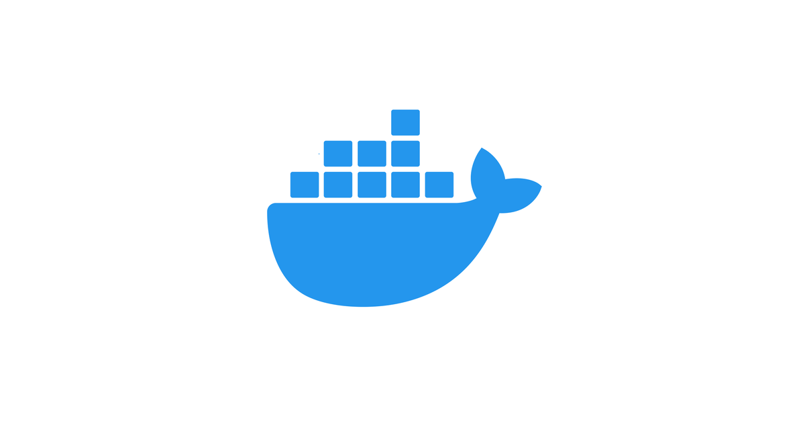
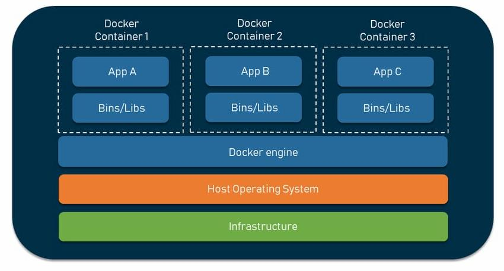
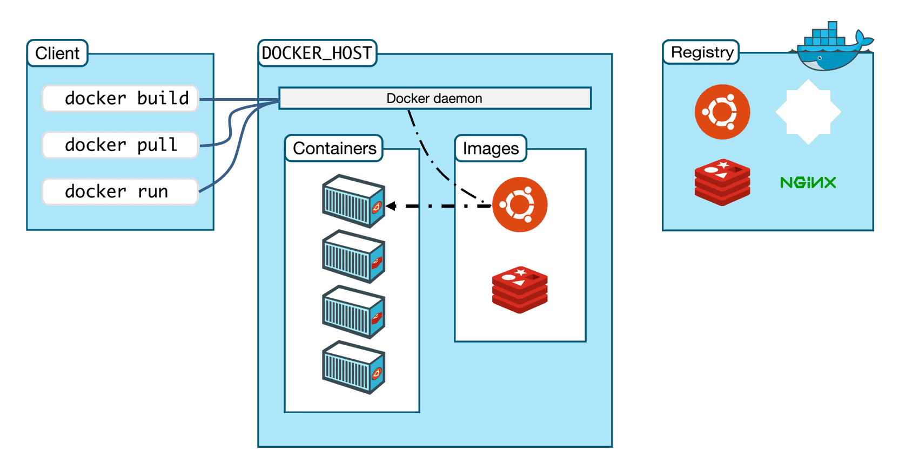

# ¿Qué es Docker?

[Docker](https://www.docker.com) es un proyecto de código abierto que permite automatizar el despliegue de aplicaciones dentro de <u>contenedores</u>.
Solomon Hykes inició Docker como un proyecto interno de dotCloud, una empresa enfocada en ofrecer servicios de plataforma como servicio (PaaS), En sus primeras etapas contó con las contribuciones de ingenieros de dotCloud, entre ellos Andrea Luzzardi y Francois-Xavier Bourlet. Asimismo, Jeff Lindsay participó como colaborador independiente. Docker representa una evolución de la tecnología patentada de dotCloud, la cual, a su vez, se desarrolló sobre proyectos de código abierto anteriores como Cloudlets.

## Contenedores
Los contenedores son un símil de la problemática existente en la gestión de mercancías en en años pasados. Cada integrante de la cadena de transporte manejaba sus propios tipos de contenedores y su forma de transportar la mercancía, lo que suponía un problema de logística
Siguiendo con un ejemplo para este ámbito, un contenedor **empaqueta de forma ligera todo lo que necesita un proceso** para funcionar:

- Código
- Herramientas del sistema
- Bibliotecas del sistema
- Dependencias
- Entre otros

Es por esto que se dice que Docker está orientado a los microservicios, ya que cada microservicio está empaquetado con sus dependencias y su código para que funcione, completamente aislado de los demás.
Esta "*encapsulación*" permite que el proceso siempre se pueda ejecutar, independientemente del entorno en donde se quiera desplegar.

# Docker vs Máquinas virtuales
Es normal que surja la duda acerca de la diferencia entre Docker y máquinas virtuales o cuándo usar una u otra. Aunque de filosofía son similares, la solución a nivel de infraestructura son diferentes.
Abordemos la diferencia con esta imagen:

## Virtualización (Máquinas virtuales)
En el caso de las máquinas virtuales, la máquina física, que está compuesta de HW, sobre lo que se instala un sistema operativo, que viene con sus binarios y librerías necesarios para su funcionamiento.
Luego se utiliza un <u>hipervisor</u>, que es una capa de software que permite gestionar los recursos para la(s) máquinas virtuales que se levanten sobre el equipo.
Sobre cada máquina virtual se implementa un hardware virtual sobre el que se instala el sistema operativo que se requiera, que a su vez tiene sus propios binarios y librerías necesarios. Son componentes completamente monolíticos e independientes entre sí.

## Contenedores
En el caso de los contenedores, partimos de la misma base que en las máquinas virtuales, pero En lugar de un hipervisor, tenemos un **daemon (demonio)** que corre en segundo plano, similar al hipervisor. La diferencia es que el daemon puede aprovechar los binarios del sistema operativo (que es compartido) para gestionar los contenedores. Esta diferencia permite ahorrar recursos ya que no se emulan sistemas operativos completos.

---

# La arquitectura de Docker

Veamos los componentes de la arquitectura de Docker.

## Docker Host
Es la máquina física o virtual (servidor, portátil, VM) que ejecuta el motor de Docker (Docker Engine) y alberga los contenedores. Proporciona los recursos de hardware y sistema operativo base, actuando como el entorno donde se crean, gestionan y ejecutan las aplicaciones contenidas, aisladas de la máquina anfitriona.

## Docker Daemon
Es el proceso central de fondo que gestiona los objetos de Docker (contenedores, imágenes, redes y volúmenes) en un sistema operativo. Actúa como servidor, escuchando las peticiones de la API REST que envía el cliente Docker (client) para ejecutar tareas como construir, iniciar o detener contenedores.

## Docker Client
Es la interfaz principal (CLI) que permite a los usuarios interactuar con el demonio de Docker (Docker Daemon) mediante comandos como `docker run` o `docker build`. Actúa como el lado cliente-servidor, enviando órdenes para gestionar contenedores, imágenes y redes. Utiliza la API de Docker para comunicarse con el demonio.

## Imágenes
Es una plantilla inmutable, ligera y ejecutable que contiene todo lo necesario para correr una aplicación: código, entorno de ejecución, herramientas, librerías y configuraciones. Actúa como el plano ("blueprint") para crear contenedores, asegurando que la aplicación funcione igual en cualquier entorno.

Características clave de las imágenes Docker:

- **Inmutables**: Una vez creada, la imagen no cambia. En caso de que se necesite actualizarla, se crea una nueva.
- **Basadas en capas**: Cada acción en el archivo `Dockerfile` (como instalar un paquete o copiar archivos) crea una capa, optimizando el espacio y la reutilización. Por ejemplo, si se tienen varias imágenes basadas en Ubuntu, Docker no guarda copias de las imágenes. Sólo se guarda la capa base que es común a todas las imágenes y la comparten, reduciendo drásticamente el espacio en disco.
- **Portabilidad**: Al empaquetar todas las dependencias, la imagen garantiza que la aplicación se comporte de manera consistente desde la máquina local del desarrollador hasta producción.

## Contenedores
Son las instancias vivas de las imágenes. Pensándolo como el paradigma de objetos, *si la imagen es la clase, el contenedor es el objeto*. El diagrama muestra varios contenedores ejecutándose de forma aislada.

## Registry
Si bien las imágenes se almacenan en el host, las imágenes las traemos de un repositorio, denominado Registro (Registry). Es un sitio en donde se suben imágenes Docker ya creadas para su uso profesional. El más utilizado es [Docker Hub](https://hub.docker.com).

[Siguiente: Instalación de Docker](./02-instalacion.md)
