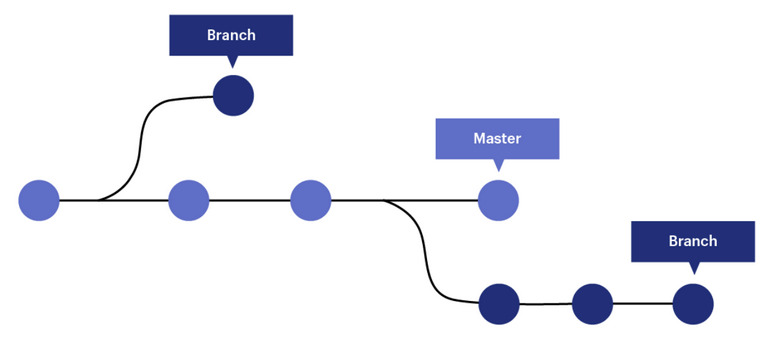

# Rama (branch)
Cuando hablamos de ramas, significa que tú has tomado la rama principal de desarrollo (master) y a partir de ahí has continuado trabajando sin seguir la rama principal de desarrollo.
Esto es particularmente útil cuando se quiere trabajar sobre una funcionalidad en un proyecto sin afectar la rama principal (master), para luego unir los cambios en la rama principal.



La forma de ver las ramas creadas en nuestro repositorio es con el comando `git branch`.
```bash
$ git branch
* master
```

Al ejecutarlo en nuestro repositorio de prueba, al no haber creadas ninguna rama además de la master, esa es la salida que tendremos. Esto significa que sólo hay una rama, que es la principal (master), y el `*` significa en qué rama estamos posicionados.

## Creando una rama
Las ramas en git se pueden crear con el comando `git branch <nombre-de-la-rama>`.
```bash
$ git branch optimizar-bucle
$ git branch
* master
optimizar-bucle
```

Aquí creamos una rama llamada `optimizar-bucle`. En este caso, crearemos la rama para optimizar un fragmento del código de un archivo de C++ sin afectar a la rama principal. A partir de este punto, si yo estoy trabajando en la rama `optimizar-bucle` y hago commits, la rama `master` no se verá afectada. Podemos ver que al ver las ramas creadas en el repositorio se ve la rama que acabamos de crear.

> [!NOTE]
> Notar que el nombre de la rama por convención general se escribe en *kebab-case*, es decir, de-esta-forma.
> También el nombre de la rama debe ser el motivo de la creación de la misma en pocas palabras.

## Moverse entre ramas
El comando `git switch <nombre-de-la-rama>` nos permite movernos entre las ramas creadas en el repositorio.
```bash
$ git branch
* master
optimizar-bucle
$ git switch optimizar-bucle
Switched to branch 'optimizar-bucle'
$ git branch
master
* optimizar-bucle
```

Este comando *está creado específicamente para moverse entre ramas*, que salió en la versión 2.23 de git. Esto se hizo para proporcionar una **alternativa más segura** al comando que se usaba antes, `git checkout`. La documentación oficial recomienda usar `git switch` para moverse entre ramas.

Tiene sentido pensar que al crear una rama, habitualmente quiera trabajar de inmediato en ella.
Luego de crear una rama, debemos movernos a ella en dos comandos distintos. Existe una alternativa para crear una rama y moverse a ella a la vez.
Con el comando `git switch -c` (-c -> create) creamos una rama y nos movemos a ella a la vez.
```bash
$ git switch -c rama-nueva
Switched to a new branch 'rama-nueva'
$ git branch
master
optimizar-bucle
* rama-nueva
```

> [!Warning]
> Cuando creamos una rama, debemos prestar atención en qué rama estamos posicionados, ya que se creará una bifurcación de la rama en la que estemos parados. Es decir, que si al crear `rama-nueva` estuviera posicionado en `optimizar-bucle`, se habría creado la rama a partir de ahí. Si queremos que la rama sea a partir de la principal, debemos antes cambiar a la rama `master`.

## Eliminar ramas
Con `git branch -d <nombre-de-la-rama>` (-d -> delete) eliminamos una rama. Para eliminar una rama debemos estar fuera de ella. Si lo intentamos, git nos dará un mensaje de error similar a lo siguiente:
```bash
$ git switch rama-nueva
Switched to branch 'rama-nueva'
$ git branch -d rama-nueva
error: Cannot delete the current branch while you are on it.
```

Luego de salirnos de la rama que queremos eliminar:
```bash
$ git branch -d rama-nueva
Deleted branch rama-nueva (was d5eb612).
```

## Cambiar de nombre una rama
Hay 2 alternativas para cambiar de nombre una rama:
- `git branch -m <nuevo-nombre-rama>` -> Cambia el nombre de la rama actual. Usado cuando queremos cambiar la rama en la que estamos posicionados.
- `git branch -m <nombre-rama> <nuevo-nombre-rama>` -> Cambia el nombre de una rama especificada. Útil cuando se necesita cambiar el nombre de una rama distinta a la que estamos posicionados.

> [!TIP]
> Si realizamos el comando `git log` veremos el historial de commits en una rama. Si queremos ver TODOS los commits que se realizaron en el repositorio, le agregamos el parámetro `--all`.

Al realizar commits en una rama, si queremos ver el estado de las otras ramas veremos que los archivos estarán sin modificarse desde el momento en que se creó la rama. Esto es importante ya que podemos trabajar en paralelo distintas funcionalidades, y cuando se decida integrar los cambios a la rama principal, se hace un <u>merge de las ramas</u>.

---

# Fusionar ramas (merge)
Si nosotros trabajamos sobre una rama, y queremos que los cambios realizados formen parte de la rama principal de desarrollo, lo podemos hacer fusionando las ramas.
## Merge
`git merge` nos permite hacer un commit nuevo en una rama específica **combinándolos** con los cambios realizados en otra rama.


Para hacer esto, nos posicionamos en la rama en la que queremos integrar los cambios de otra rama y usamos el comando de la siguiente manera:

```bash
$ git branch
master
* optimizar-bucle
$ git switch master
Switched to branch 'master'
$ git merge optimizar-bucle
Updating d5eb612..80468f9
Fast-forward
test.cpp | 13 ++++++-------
1 file changed, 6 insertions(+), 7 deletions(-)
```

Como se ve, todos los commits hechos en la rama `optimizar-bucle` se integran en la rama `master`. Al ver los archivos en el repositorio, se ven los cambios hechos en la rama presentes en la rama `master`. Luego de esto, ***cuando la rama cumple su función, se elimina***, o si se pretende utilizar en algún otro momento, se deja ahí para continuar el trabajo.

# Merge conflicts
Es común que se produzca un **merge conflict** cuando se crea una rama en el repositorio, se trabaja sobre la misma, y luego se integran los cambios en la rama principal. Hasta aquí son conceptos que ya explicamos, pero, ¿Qué pasa si en la rama padre (sobre la que se crea una rama) se realiza una modificación después de haber creado la rama? Es decir:
Desde `master` creamos una rama llamada `rama-nueva`. En la nueva rama hacemos modificaciones sobre uno o más archivos.
También, en master, se realiza una modificación sobre los archivos. Cuando queremos fusionar `rama-nueva` en `master`, *¿Con qué cambios nos quedamos?* ¿Con los cambios hechos en `master`? ¿Con los cambios en `rama-nueva`? ¿Nos quedamos con los dos cambios? ¿Con ninguno?
Estas preguntas son las que tenemos que resolver por git cuando tenemos que fusionar ramas y se nos presenta esta problemática, que es bastante habitual.


> [!WARNING]
> Es importante que, al resolver conflictos de fusión de ramas, prestar atención a los cambios que queremos mantener, y cuáles queremos quitar.
> Igualmente, si nos equivocamos, podemos hacer un `git reset --hard <commit-antes-de-fusión>` para volver hacia atrás y volver a intentarlo, si lo necesitamos.

# Actualizando una rama (rebase)
El comando `git rebase` se usa para <u>integrar cambios de una rama en otra</u>, pero a diferencia de `git merge`, que crea un nuevo *commit de fusión*, `git rebase` reescribe el historial de commits para aplicar tus cambios sobre otra base.

### Ejemplo
Supongamos que tenemos dos ramas:

- `master` -> La rama principal
- `una-rama` -> Una rama en la que estás trabajando

Si en la rama `master` ha habido nuevos cambios y queremos actualizar `una-rama` con esos cambios, usamos `git rebase`.
Veamos cómo hacerlo:
1. Asegurarnos de estar en la rama que queremos actualizar. En este caso, `una-rama`.
2. Hacer el `rebase` con la rama que queremos integrar los cambios. En este caso, `master`.
3. *Resolver conflictos*, si los hay. Es habitual que surgan conflictos a la hora de hacer un `rebase`, por lo que deberemos solucionarlos.

[Siguiente: Estragegias de fusión de ramas](07-metodos-merge.md)
