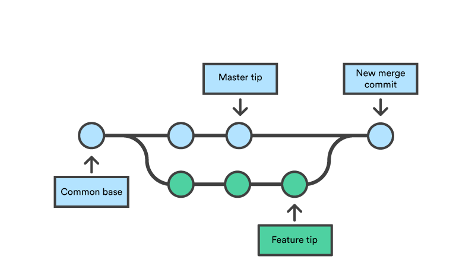

# Estrategias de fusión de ramas
Cuando se fusionan ramas en Git, existen diferentes formas de hacerlo, y la manera de fusionar los cambios puede afectar el historial del repositorio. Aquí te explico las tres formas principales en que puedes fusionar cambios: **Merge**, **Rebase** y **Squash Merge**.

## 1. Merge (Fusión simple)

La fusión tradicional de Git, conocida como **merge**, toma dos ramas y combina sus cambios en una nueva **"commit de fusión"** (merge commit). Esta es la opción por defecto cuando haces un pull request en GitHub.

### ¿Cómo funciona el Merge?
- Cuando fusionas dos ramas (por ejemplo, tu rama de características `feature` en la rama `main`), Git toma los cambios de ambas ramas y crea un nuevo **commit** que tiene dos padres: el último commit de la rama base (por ejemplo, `main`) y el último commit de la rama que estás fusionando (por ejemplo, `feature`).
- El resultado es un historial de commits que refleja todos los cambios realizados en ambas ramas y un merge commit que actúa como el punto de fusión.



### Características del Merge:
- **Historial no lineal**: El historial conserva todos los commits de ambas ramas, lo que puede resultar en un historial más "ramificado".
- **Fácil de usar**: Es el método más simple y seguro, ya que no modifica el historial de la rama de destino.
- **Problemas con la claridad del historial**: Si se hacen muchas fusiones, el historial puede volverse confuso debido a la cantidad de "merge commits" que se generan.

### Ejemplo de comando:
```bash
git checkout main        # Cambia a la rama de destino
git merge feature        # Fusiona la rama 'feature' a 'main'
```

## 2. Rebase

El **rebase** es otro método para fusionar ramas, pero en lugar de crear un merge commit, reescribe el historial de la rama de destino para incluir los commits de la otra rama (por ejemplo, la rama `feature`) de manera **lineal**.

### ¿Cómo funciona el Rebase?
- En lugar de fusionar las ramas, el `rebase` toma los commits de tu rama (por ejemplo, `feature`) y los "re-aplica" uno por uno sobre la rama de destino (por ejemplo, `main`).
- El historial de la rama `feature` se reescribe, lo que hace que parezca que los cambios se hicieron directamente sobre la rama de destino, como si hubieras comenzado a trabajar sobre `main` desde el principio.


### Características del Rebase:
- **Historial lineal**: El historial se vuelve más limpio y fácil de leer porque no hay merge commits. Los commits de la rama `feature` se añaden al final de la rama `main`, como si todos los cambios se hubieran hecho en una secuencia continua.
- **Reescribe el historial**: Esto puede ser problemático si otros colaboradores ya han trabajado sobre la rama `feature`, ya que perderían el historial original y podrían tener conflictos.
- **Uso más avanzado**: Aunque tiene beneficios en la limpieza del historial, el `rebase` puede ser más complejo y arriesgado si no se entiende bien, especialmente cuando hay conflictos.

### Ejemplo de comando:
```bash
git checkout feature      # Cambia a la rama que quieres rebasear
git rebase main           # Rebase de 'feature' sobre 'main'
```

Después de hacer el `rebase`, debes hacer un **push forzado** si ya habías subido la rama a un repositorio remoto, ya que el historial ha sido reescrito:
```bash
git push --force
```

## 3. Squash Merge (Comprimir commits)

El **squash merge** es una opción en GitHub que te permite combinar todos los cambios de una rama en **un solo commit** antes de fusionarlos a la rama de destino. Esto es útil cuando tienes varios commits pequeños, intermedios o de prueba que no son necesarios como parte del historial de la rama de destino.

### ¿Cómo funciona el Squash Merge?
- En lugar de fusionar la rama tal como está, Git aplana todos los commits de la rama en un único commit y lo fusiona con la rama de destino.
- Esto limpia el historial de la rama de destino, ya que no se incluirán los commits intermedios de la rama `feature` (por ejemplo, correcciones, experimentos, commits de depuración, etc.), solo un único commit que representa todos los cambios importantes.


### Características del Squash Merge:
- **Historial limpio**: El historial de la rama de destino se mantiene limpio y sencillo, sin los detalles de cada pequeño cambio hecho en la rama `feature`.
- **Pierde el historial de la rama de características**: Aunque el historial en la rama `main` será más limpio, los commits individuales de la rama `feature` se perderán.
- **Ideal para contribuciones pequeñas o experimentales**: Si tienes una serie de commits pequeños que no son relevantes para la historia final del proyecto, un `squash merge` es una buena opción.

### Ejemplo de comando (en GitHub):
Cuando usas GitHub, puedes elegir la opción **"Squash and merge"** al fusionar el PR, lo que comprimirá todos los commits en un solo commit antes de fusionarlos.

En la línea de comandos, si deseas hacer un **squash** antes de un merge, puedes hacerlo manualmente:
```bash
git checkout main              # Cambia a la rama principal
git merge --squash feature      # Realiza un squash de la rama 'feature'
git commit -m "Mensaje del commit"  # Confirma los cambios como un solo commit
```

## Resumen y cuándo usar cada uno:
- **Merge**: Es el método más seguro y simple, adecuado para proyectos donde se quiere preservar el historial de todas las ramas, aunque puede hacer que el historial sea más complejo.
- **Rebase**: Ideal cuando se desea un historial limpio y lineal, pero es más arriesgado si otras personas están trabajando en la misma rama.
- **Squash Merge**: Perfecto para cuando se quieren combinar muchos pequeños commits en uno solo para mantener un historial más limpio, especialmente en contribuciones de código abierto.

Cada método tiene sus pros y contras dependiendo de cómo prefieras gestionar el historial y la colaboración en tu proyecto.

[Siguiente: Ignorar archivos](08-gitignore.md)
