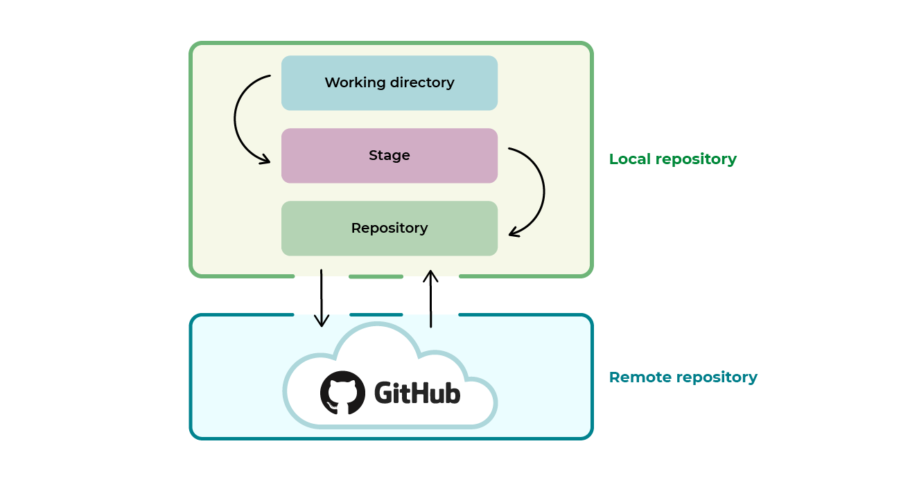

# ¿Qué es GitHub?
**GitHub** es un portal creado para alojar repositorios, y que fue comprada por <u>Microsoft</u> en junio del 2018. La plataforma está creada para alojar proyectos utilizando el sistema de control de versiones Git. Se utiliza principalmente para la creación de código fuente de programas.
La opción de poder alojar repositorios en web nos permite trabajar de manera colaborativa con una o más personas agregadas a los proyectos.

Trabajar con GitHub nos lleva a crear una nueva "área" en la que los archivos se moverán, además del espacio de trabajo, staging, y repositorio local que ya vimos anteriormente. Además de esas tres areas, tenemos un ***repositorio remoto*** que es en donde se alojan los archivos en los servidores de GitHub, de manera todas las personas involucradas en el proyecto puedan solicitar datos del repositorio, para actualizar los cambios en su espacio de trabajo, o bien subirlos al repositorio remoto para que pueda ser visto por los demás miembros del equipo de desarrollo.



## Registrarse en GitHub
Antes que nada, debemos crearnos una cuenta en GitHub. Ir al [sitio web de GitHub](https://www.github.com) para crear una cuenta.

---

# Primeros pasos
A continuación, veremos las acciones más comunes y básicas a la hora de usar Git y GitHub.
Asumiremos que en nuestro perfil de GitHub tenemos un repositorio creado. Para este caso, el repositorio se llamará `repotesthub`.
Ver cómo crear un repositorio [aquí](https://docs.github.com/en/repositories/creating-and-managing-repositories/creating-a-new-repository).

> [!IMPORTANT]
> Es necesario que el e-mail configurado en nuestro entorno de git sea el mismo que el correo que usamos para iniciar sesión en GitHub.

## Clonar un repositorio
Se entiende por **clonar un repositorio** por tomar un repositorio subido a un servidor y descargar una copia en nuestra computadora local.
Esto implica que tendremos en nuestra computadora los archivos del repositorio, el historial de commits, las ramas, toda la información relacionada al manejo del repositorio.

Para clonar un repositorio, debemos ir a la página donde está el repositorio que queremos clonar, copiamos la URL y ejecutamos el siguiente comando:

```bash
$ git clone https://github.com/usuario/repotesthub
Cloning into 'repotesthub'...
remote: Enumerating objects: 6, done.
remote: Counting objects: 100% (6/6), done.
remote: Compressing objects: 100% (5/5), done.
remote: Total 6 (delta 0), reused 0 (delta 0), pack-reused 0 (from 0)
Receiving objects: 100% (6/6), done.
```

Esto creará un directorio llamado `repotesthub` en el directorio de trabajo actual. Notar que si el repositorio es privado, deberemos tener los permisos para clonarlo.

Notamos que al entrar en el repositorio, tenemos el historial de commits, ramas, entre otras cosas. Si vemos la lista de commits con `git log`:
```bash
$ git log --oneline
25614a5 (HEAD -> main, origin/main, origin/HEAD) Add pila_v2.cpp
742c59a Initial commit
```

Vemos que se muestran los commits como ya vimos anteriormente, pero el último commit, que es donde apunta `HEAD`, vemos que aparecen cosas nuevas:
- `origin/main`: Muestra que el repositorio remoto (referenciado como `origin`) también tiene una rama llamada `main`, y actualmente esa rama está apuntando a ese commit.
- `origin/HEAD`: Esto señala el commit que está vinculado al `HEAD` del repositorio remoto. En muchos casos, esto indica el estado de la rama principal del repositorio remoto. Es decir, ese commit es al que apunta el puntero del repositorio remoto.

Si vemos el estado del repositorio con `git status`:

```bash
$ git status
On branch main
Your branch is up to date with 'origin/main'.

nothing to commit, working tree clean
```

Vemos que como mensaje nuevo se agrega que, en este caso, la rama en la que estamos posicionados actualmente, está actualizada respecto al repositorio remoto.
En otras palabras:
- No hay cambios nuevos en la rama remota (origin/main) que no tengas ya en tu rama local.
- No tienes cambios locales pendientes de ser subidos al repositorio remoto.

Si hubiera algún cambio pendiente de ser subido o algún cambio en el repositorio remoto que aún no hayas descargado, el mensaje sería diferente (por ejemplo, indicándote que tienes cambios que deben ser "<u>pusheados</u>" o que debes hacer un *pull* para actualizar tu repositorio local).

[Siguiente: Subiendo los cambios a un repositorio remoto](11-push.md)
