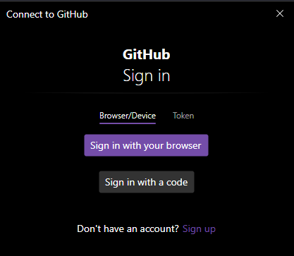

# Subir y descargar cambios en el repositorio
Cuando trabajamos con un repositorio de GitHub, hacemos dos acciones principales:

- Descargar información de un repositorio
- Subir información a un repositorio

Es decir, cuando vamos a trabajar en cambios en un proyecto remoto, luego de terminar con los cambios, subimos dichos cambios al repositorio.
Y cuando necesitamos actualizar los datos del repositorio local con los nuevos cambios del repositorio remoto, es cuando descargamos la información del repositorio.

 ---

# Git push
El comando `git push` se utiliza para enviar los cambios de tu repositorio local a un repositorio remoto. En términos simples, sube tus commits locales a una rama de un repositorio remoto.
Cuando se hacen commits en un repositorio local, esos cambios no se reflejan automáticamente en el repositorio remoto. Usando `git push`, envías esos commits al repositorio remoto para que otros colaboradores puedan verlos.

## Uso de git push

```bash
$ git push <remoto> <rama>
```

- `<remoto>`: El nombre del repositorio remoto (generalmente es `origin`, que es el nombre por defecto que Git asigna al repositorio remoto al clonarlo).
- `<rama>`: El nombre de la rama que deseas enviar al repositorio remoto (por ejemplo, `main`).

Si es la primera vez que realizamos un `push` al repositorio local, veremos que se nos abrirá una ventana como esta:



Esto significa que debemos autenticarnos para poder adjudicar los cambios, y que se validen los permisos correspondientes para interactuar con el repositorio.
Lo recomendable es iniciar con un token de acceso personal. Para esto, vamos a nuestro perfil de GitHub -> Settings -> Developer settings -> Personal access tokens y crear un token clásico con los permisos necesarios. En este caso, con que tenga ámbito de repositorio, es suficiente.
Ver más sobre Tokens de acceso personal [aquí](https://docs.github.com/en/authentication/keeping-your-account-and-data-secure/managing-your-personal-access-tokens).
A la hora de elegir la expiración del token, no se recomienda la opción de no expiración, y a medida que el proyecto tenga mayor cantidad de colaboradores y su rotación, el tiempo de expiración sea más corto.

```bash
$ git push origin main
Enumerating objects: 5, done.
Counting objects: 100% (5/5), done.
Delta compression using up to 6 threads
Compressing objects: 100% (3/3), done.
Writing objects: 100% (3/3), 467 bytes | 467.00 KiB/s, done.
Total 3 (delta 1), reused 0 (delta 0), pack-reused 0 (from 0)
remote: Resolving deltas: 100% (1/1), completed with 1 local object.
To https://github.com/usuario/repotesthub
   25614a5..e84373b  main -> main
```

Este comando enviará los cambios de la rama `main` de tu repositorio local al repositorio remoto llamado `origin`.

[Siguiente: Pull y fetch](12-pull-fetch.md)
