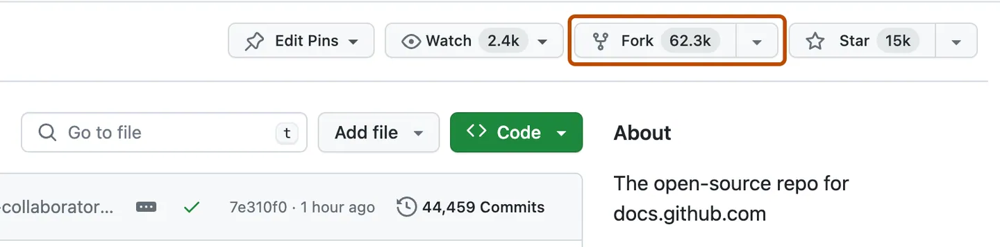
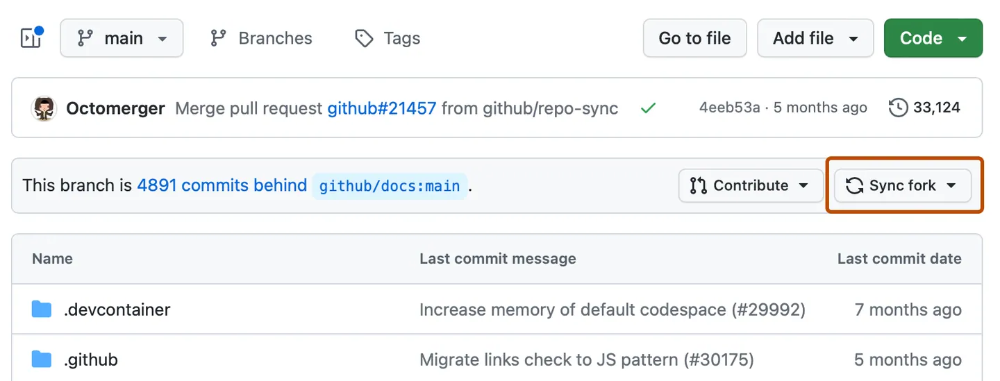

# Forks y contribuciones
Un *fork* o bifurcación en GitHub es una <u>copia de un repositorio que se crea bajo tu cuenta de GitHub</u>. Es una manera de clonar un repositorio remoto para poder hacer cambios de forma independiente sin afectar el proyecto original.
Hacer un fork te permite trabajar en un proyecto, hacer modificaciones y, si lo deseas, proponer esos cambios al repositorio original mediante un [pull request](15-pull-requests.md#Pull-request).


## Cómo hacer un fork de un repositorio

1. Navegar hasta el repositorio de GitHub que queremos *forkear*.
2. En la esquina superior de la página, clickear en **Fork**.



3. En la opción "Owner", seleccionar el dueño del fork.
4. Por defecto los repositorios bifurcados tienen el mismo nombre que el proyecto original. Es posible cambiar el nombre si se necesita.
5. De manera opcional, escribir una descripción del fork.
6. Opcionalmente, **COPIAR SÓLO LA RAMA PRINCIPAL.**
Comúnmente, a la hora de hacer forks, por ejemplo para contribuir a proyectos open-source, sólo es necesario copiar la rama principal de desarrollo. Es posible también copiar todas las ramas en el fork.
7. Click en **Create fork**.

---

## Clonar y configurar un repositorio forkeado
Una vez que hacemos un fork de un repositorio, podemos clonarlo para tener una copia local del repositorio de manera normal.

Cuando se bifurca un proyecto, se puede configurar Git para que cuando hagamos un `pull`, que descargue los cambios del proyecto original al clon local de nuestro fork. Es una manera de, <u>mientras trabajamos en el fork, se mantiene actualizado con los últimos cambios del proyecto original</u>.

Estando posicionados en el fork del repositorio:
1. Introducir el comando `git remote -v`. Veremos el repositorio remoto configurado para nuestro fork.
```bash
$ git remote -v
> origin  https://github.com/YOUR-USERNAME/YOUR-FORK.git (fetch)
> origin  https://github.com/YOUR-USERNAME/YOUR-FORK.git (push)
```

Vemos que está conectado con nuestro fork. Pero podemos configurar el repositorio para que cuando se ejecute un `fetch`, busque los cambios en el repositorio original.

2. Escribir el comando `git remote add upstream` y luego la URL del repositorio original.
```bash
$ git remote add upstream https://github.com/ORIGINAL-OWNER/ORIGINAL-REPO.git
```

Esto hará que se agrege un nuevo repositorio remoto asociado de nombre `upstream`.
Para verificar que se configuró correctamente, volvemos a ejecutar `git remote -v` y deberíamos ver algo así:
```bash
$ git remote -v
> origin    https://github.com/YOUR-USERNAME/YOUR-FORK.git (fetch)
> origin    https://github.com/YOUR-USERNAME/YOUR-FORK.git (push)
> upstream  https://github.com/ORIGINAL-OWNER/ORIGINAL-REPO.git (fetch)
> upstream  https://github.com/ORIGINAL-OWNER/ORIGINAL-REPO.git (push)
```

De esta manera, cuando hagamos un `pull`, podemos elegir si descargar los cambios de nuestro fork (`origin`), o del repositorio original (`upstream`).
A continuación se muestran 2 ejemplos de `pull` con las opciones:

```bash
$ git pull origin main
$ git pull upstream main
```

## Actualizar un fork
Desde la página de GitHub, también podemos actualizar nuestro fork cuando esté uno o más commits atrasados del repositorio principal.
Para esto simplemente navegamos a la página principal del repositorio forkeado y clickeamos en **Sync fork**.

Luego revisamos los cambios del repositorio principal, y hacemos click en **Update branch** (actualizar rama).
Si los cambios del repositorio original causan conflictos, GitHub nos pedirá crear un **pull request** para resolver esos conflictos.

[Siguiente: Pull requests](15-pull-requests.md)
