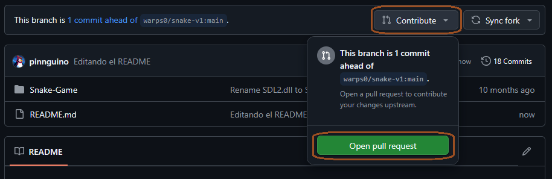

# Pull request
Un **pull request** o abreviado *PR* en GitHub es una <u>solicitud para que los cambios que has realizado en un repositorio</u> (generalmente en una rama o fork) <u>sean revisados e integrados (fusionados) en otro repositorio o rama</u>. Este es el principal mecanismo que se usa para colaborar en proyectos de código abierto y también en equipos de desarrollo que trabajan con GitHub.

## ¿Cómo funciona un PR?
Primero, se crea una rama en tu fork y realizas los cambios que deseas. Estos cambios pueden ser correcciones, nuevas características, o mejoras en la documentación.
Una vez que tienes los cambios listos y *commiteados*, se envía un pull request en GitHub desde nuestra rama hacia la rama principal del repositorio en el que deseas colaborar (generalmente `main` o `master`). Si estás trabajando en un fork, el PR será desde tu fork hacia el repositorio original.
Cuando queramos hacer un pull request de nuestros cambios, vamos a la página de nuestro fork, y hacemos click en **Contribute** > **Open pull request**.

Desde aquí, podemos elegir desde qué rama del fork a qué rama del repositorio original queremos hacer el PR, y GitHub nos dirá si los cambios pueden fusionarse automáticamente. De no ser posible fusionar, deberemos resolver los conflictos.

Luego podemos agregarle un título y una descripción a nuestro pull request. Estos datos deben ser claros y detallados sobre los cambios y el motivo del PR.

## Revisión de un PR
Luego de enviar un pull request, los propietarios del repositorio original o los colaboradores revisarán el PR. En este paso, pueden ver los cambios que se proponen, hacer comentarios, sugerir modificaciones y realizar revisiones. Si están de acuerdo con los cambios, el PR puede ser aprobado.
Si el PR es aprobado, los cambios se fusionan con la rama del repositorio original. Esto puede hacerse de varias maneras, como un *merge* (fusión) simple, un *rebase*, o una *squash merge* (comprimir los commits). La fusión coloca tus cambios en la rama principal del proyecto.
Para más información sobre fusión de cambios, ver aquí.
Una vez que los cambios se han fusionado o rechazado, *el pull request se cierra*. Si los cambios no son aceptados, puedes corregirlos y volver a enviar un nuevo pull request, o bien hacer modificaciones en tu repositorio sin fusionarlo.

[Siguiente: GitHub Issues](16-github-issues.md)
