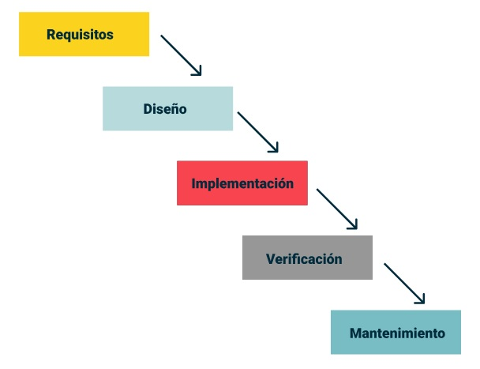

# Metodologías ágiles

## Introducción

Al principio de la década de los noventa, varios pensadores de la ingeniería de software empezaron a proponer maneras de desarrollar software que se apartaban del enfoque predominante en uso.
Se buscaba la definición e implementación de procesos y herramientas de desarrollo robustos que permitan garantizar resultados de calidad, independientemente de las personas involucradas.
En aquella época, el modelo predominante era el <u>ciclo en cascada</u> que ordena secuencialmente y rigurosamente las etapas del ciclo de vida del software. Es decir, cada etapa debe esperar a la finalización de la anterior.

Este modelo de apoya en el congelamiento de los requisitos de software temprano en los proyectos, lo que permite una predicción con poca incertidumbre para el desarrollo resultante.
Sin embargo, hay algunas cosas a considerar:

1. El **cambio en los proyectos de software** es más la regla que la exepción.

2. El ambiente de los proyectos suele ser inestable y a veces caótico, lo que implica que el proceso de diseño e implementación de soluciones requiere **alta adaptabilidad** y **creatividad**.

---

## Génesis de las metodologías ágiles

Estos puntos les permitieron a los pensadores de las metodologías ágiles crear un nuevo enfoque donde *el cambio, la adaptabilidad y la creatividad* son los principales pilares del desarrollo de software.

El 12 de febrero del 2001, 17 experimentados profesionales asociaron el adjetivo "ágil" a sus metodologías de trabajo, para asociarles una noción de resultados rápidos y liviandad. También crearon y firmaron el conocido [Manifiesto Ágil](02-manifiesto-agil.md), una declaración de valores para el desarrollo de software.

---

## Tabla de contenidos

### [El Manifiesto Ágil](01-manifiesto-agil.md)
### [Características de las metodologías ágiles](02-caracteristicas.md)
### [Principales Metodologías Ágiles](03-principales-metodologias.md)
### [Scrum](04-scrum.md)
### [Historias de usuario](05-historias-de-usuario.md)
