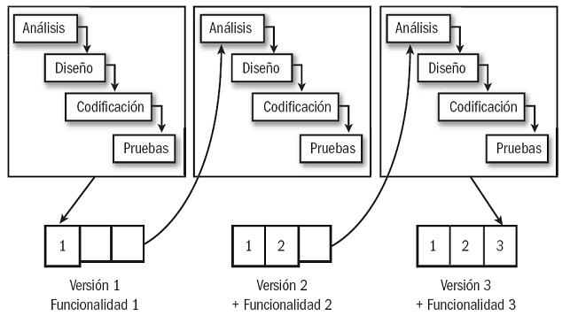

# Características de las metodologías ágiles

Se enumeran a continuación algunas de las principales características claves de las principales metodologías ágiles:

### Ciclo de vida iterativo e incremental
La gestión ágil tiene como meta entregar un <u>producto con el mayor valor posible</u> para el cliente en un tiempo dado (*time boxed*).
Para ello, se emplea un *ciclo de vida iterativo e incremental*. Este ciclo se contrapone con el [modelo en cascada](00-index.md#Introducción) visto anteriormente, ya que permite ir descubriendo cuáles son las funcionalidades que aportan más valor al cliente a medida que se entrega cada iteración.

### Los requerimientos de un producto cambian con el tiempo
Durante la ejecución del proyecto pueden surgir cambios regulatorios, cambios en la organización, la operatoria, el negocio, o quizás que a medida que se va desarrollando el proyecto se va entendiendo mejor la problemática, o que los mismos interesados definan mejoras que no identificaron de antemano.

### No se construye el mejor producto con un solo intento
Es fundamental que el equipo tome el proyecto como un camino de aprendizaje, <u>obteniendo feedback frecuente del usuario</u> para ir descubriendo con él la mejor forma de solucionar su problemática.

[Siguiente: Principales Metodologías Ágiles](03-principales-metodologias.md)
