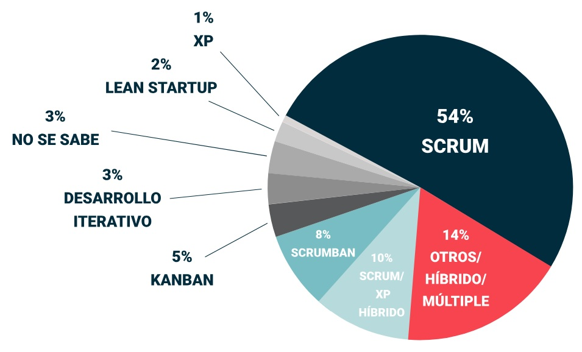

# Principales metodologías ágiles

A continuación veremos una breve descripción de las metodologías ágiles más adoptadas.

insertar el cuadro de la página 8, SCRUM 1 :)

---

## Estado de adopción
Es notable el alto grado de adopción de las metodologías ágiles en toda la industria del software alrededor del mundo. VersionOne realiza una encuesta pública en toda la industria de software alrededor del mundo con el fin de descacar cuáles son las metodologías más adoptadas:

[Siguiente: Scrum](04-scrum.md)
