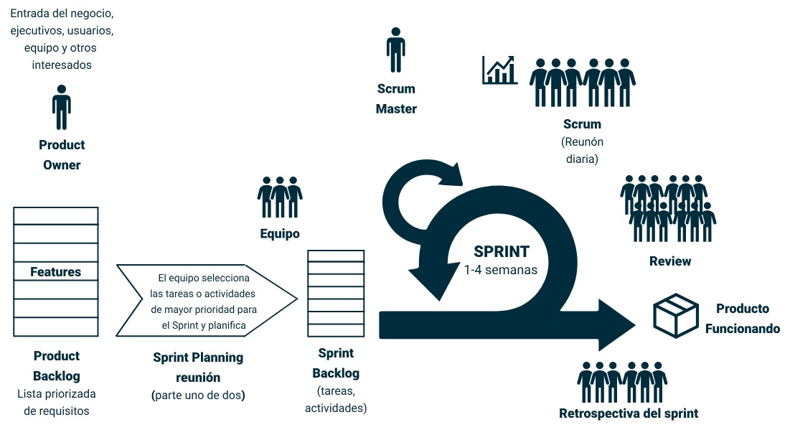
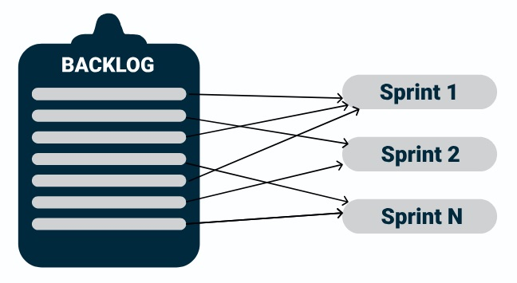
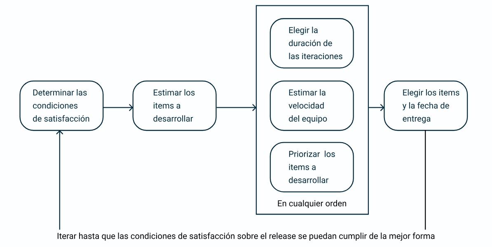
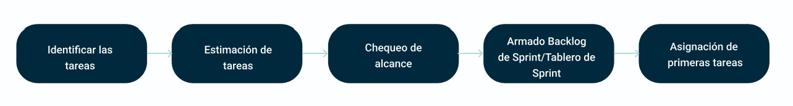
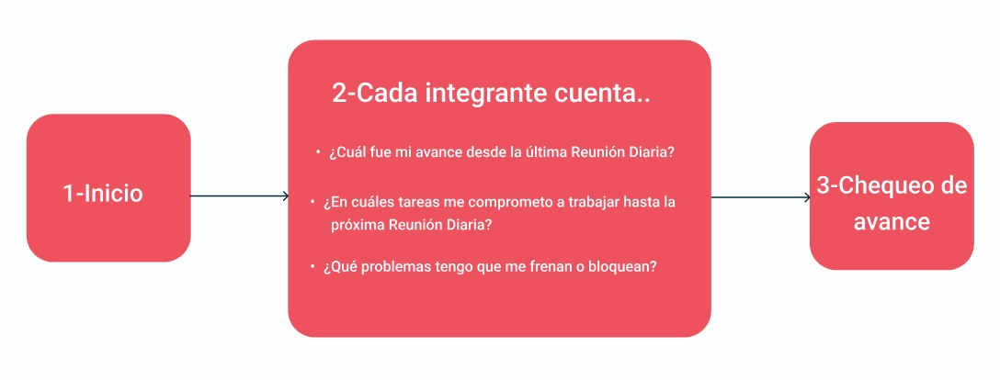
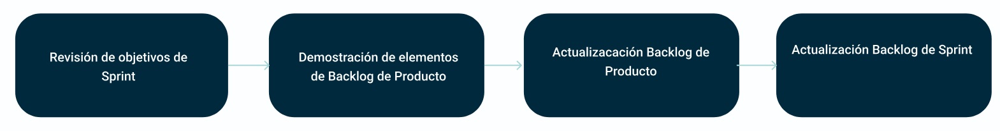
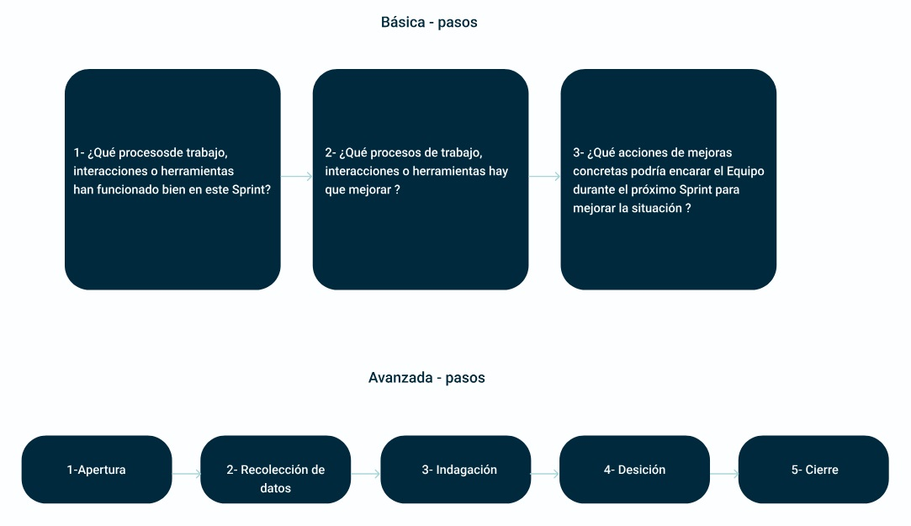

# Scrum
Scrum utiliza un proceso iterativo e incremental donde se ejecutan iteraciones de duración corta, manteniendo a un ritmo parejo en el paso por la planificación, la ejecución y la reflexión sobre lo ocurrido.

## Marco de trabajo
A continuación explicaremos el siguiente diagrama del ciclo de Scrum:

- El **Dueño del Producto** crea una lista priorizada de requisitos llamada **Backlog de Producto**.
- En la **Planificación** (2-4hs), el equipo selecciona una porción de la lista, un **Backlog de Sprint**, y decide cómo implementar estos requisitos.
- Luego se lleva a cabo un **Sprint** (1 a 4 semanas) para terminar su trabajo. Los miembros del equipo se reúnen diariamente para constatar su progreso en la **Reunión Diaria o Daily** ( 15 minutos).
- Este camino, el **Scrum Master** mantiene al equipo enfocado hacia su objetivo.
- El objetivo del sprint es que el trabajo debería ser *potencialmente entregable*, es decir, estar listo para enviar a un cliente, enpaquetar para su distribución o presentar a un sponsor.
- Cuando el sprint termina, se lleva a cabo un **Revisión del Sprint** y una **Retrospectiva**.

Este ciclo se repite hasta que el backlog del producto se haya completado, que el presupuesto se haya agotado, o que un hito definitivo haya llegado (depende de cada proyecto).

---

## Detalles de Scrum
Procedamos a detallar los elementos presentes en el diagrama de un ciclo Scrum para entenderlo con más detalle.

### Sprint
Es el nombre que recibe una iteración en Scrum.

→ Se acuerda una **duración fija** de entre una y cuatro semanas para todos los sprints.

→ Se ejecutan uno tras otro respetando la duración del mismo, sin tiempo muerto entre el sprint que termina y el que empieza.

→ El objetivo es transformar un conjunto del Backlog de Producto en un <u>Incremento de Funcionalidad de Producto Potencialmente Entregable</u>.

### Roles
En la metodología Scrum se formalizan tres roles:

**Dueño de Producto (Product Owner)**: Es la voz del cliente, el que establece una visión sólida del producto a desarrollar y prioriza continuamente los requisitos para alcanzar dicha visión.
Sus responsabilidades son:
- Canalizar las necesidades del negocio
- Maximizar el valor para el negocio
- Inspeccionar y adaptar el producto

**Scrum Master**: Es un líder servicial para el equipo, pero también un facilitador y agente de cambio para la aplicación adecuada de Scrum en el equipo y la organización.
Sus responsabilidades:
- Asegurar la correcta aplicación de Scrum.
- Eliminar los impedimientos que frenan el trabajo del equipo.

**Equipo**: Es un grupo *auto-organizado*, multidisciplinario y con autonomía, que desarrolla el producto. La única responsabilidad es transformar el *Product Backlog* en <u>incrementos de funcionalidad</u> potencialmente entregable en cada sprint. El equipo también se caracteriza por ser autogestionado.

### Artefactos

**Product Backlog**: Es una lista única, pública y dinámica que recopila una <u>secuencia priorizada de requerimientos para el producto</u>. Algunos de estos requerimientos tienen una estimación de alto nivel de esfuerzo y complejidad. Representa el "qué" esperado del producto, sin preocuparse por el "cómo".

En el Product Backlog se debe medir la completitud de los ítems.

> **DONE**
> Es un entendimiento común que se acuerda y se va refinando con el Equipo Scrum sobre **qué significa que un ítem del Backlog está terminado** basado en unos estándares de calidad.

Se busca mejorar el Product Backlog para las próximas ceremonias de Planificación, mejorar su calidad, y que el mismo sea **DEEP** (Detallado apropiadamente, Estimado, Emergente, Priorizado) mediante la actividad de **Refinamiento del Backlog**.

**Sprint Backlog**: Es un subconjunto de ítems del Product Backlog que <u>el equipo se compromete durante el tiempo alocado al Sprint</u>. Cada ítem incluido en el Sprint es dividido en tareas detalladas que el equipo completará, con una estimación que no supere un día de esfuerzo.
Es actualizado diariamente por el equipo, y muestra en cada momento las tareas pendientes, en curso y terminadas para completar los items del Srpint.

**Incremento de Funcionalidad Potencialmente Entregable**: Al final de cada Sprint *el equipo debería entregar un incremento de funcionalidades del producto* con una calidad productiva. El mismo debe funcionar, y si quedan tareas pendientes para su entrega, deberían requerir esfuerzo mínimo.

### Ceremonias

**Planificación**: También llamado Sprint Planning, se basa en entender y determinar ael trabajo que el Equipo se compromete a terminar en el Sprint y cómo se va a realizar.
Consta de dos partes:
- **Parte 1**: Se centra en "*qué*" es lo que el Product Owner quiere que se desarrolle en el Sprint.

- **Parte 2**: Se centra en "*cómo*" implementar los elementos que el Equipo decide incluir en el sprint.

**Reunión Diaria (Daily)**: Aquí se comparte con el equipo el avance del trabajo comprometido para el Sprint, así como coordinar las actividades del equipo para completar las tareas del Sprint.

**Revisión**: Se busca demostrar claramente el progreso del equipo, y recibir feedback periódico de los usuarios/clientes sobre los productos/resultados generados.

**Retrospectiva**: El objetivo principal es buscar puntos de mejoría para el equipo, escuchando distintos puntos de vista e identificar las causas de los principales problemas del equipo durante el Sprint.

---

## VALORES FUNDACIONALES DE SCRUM
En las secciones anteriores se ha presentado el marco de trabajo de Scrum, con sus distintos roles, artefactos y ceremonias.
Es importante destacar unos mecanismos subyacentes de Scrum que se encuentran en la mayoría de sus roles, artefactos y ceremonias y que potencian fuertemente esta metodología:

### Time-Boxing
Primero el sprint tiene una duración fija pre-establecida a respetar, y esta duración es la que da el ritmo al equipo. Con el paso de los sprints el equipo empieza a conocerse mejor y a saber exactamente lo que pueden comprometer y entregar en un sprint.
Por otro lado, las ceremonias del Sprint son también limitadas en el tiempo, como clara definición de cuánto tiempo se quiere invertir en actividades de gestión en cada sprint, aunque el resultado sea imperfecto y mejorable. Es típico que para un sprint de 2 semanas se haga una Planificación de 2h, unas Dailys de 15 minutos, una Revisión de 1-2h y una Retrospectiva de 1h30m.

### Empirismo y Auto-Organización
En ambientes cambiantes con proyectos inestables y a veces caóticos, las metodologías ágiles se basan en el empirismo y la auto-gestión de un equipo para *encontrar y madurar la mejor forma de trabajar e interactuar para resolver una problemática*.
El mecanismo de prueba y error es entonces la base del ciclo de vida iterativo, permitiendo probar en cada iteración si es necesario nuevas formas de trabajar e interactuar para ir refinando un proceso de trabajo en equipo de a poco.
Scrum se basa en la **auto-gestión eliminando roles de liderazgo enfocados a la asignación** y el control del equipo, simplemente porque se demuestra que las personas mejor calificada para estimar, comprometer, definir tareas son las que las ejecutan. Es una
forma de reforzar el compromiso de los equipos y hacerlos crecer como tal.

### Mejora Continua y Retrospección
Scrum plantea varios mecanismos para recolectar feedback (a través de Revisión y Retrospectivas), tanto sobre los productos construidos como sobre el proceso de trabajo y sus interacciones. De esta forma, a través de un ciclo iterativo e incremental se puede aplicar acciones concretas de mejoras al proceso y al producto.
La retrospección es el mecanismo fundamental de aprendizaje en Scrum, y se concreta principalmente con la ceremonia de Retrospectiva.

[Siguiente: Historias de Usuario](05-historias-de-usuario.md)
